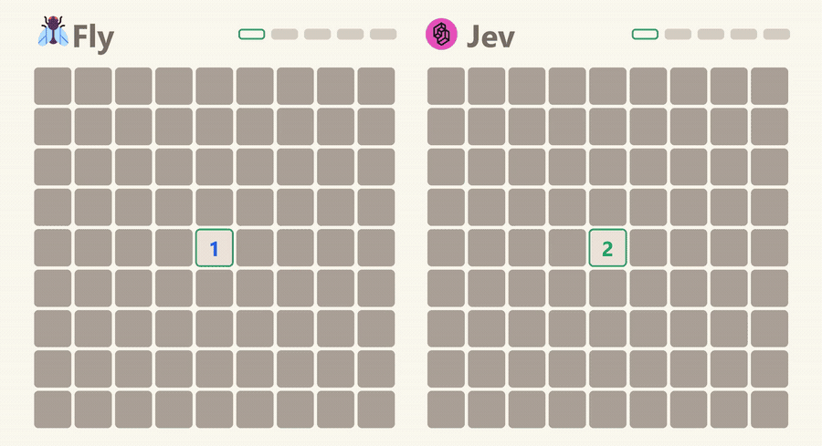
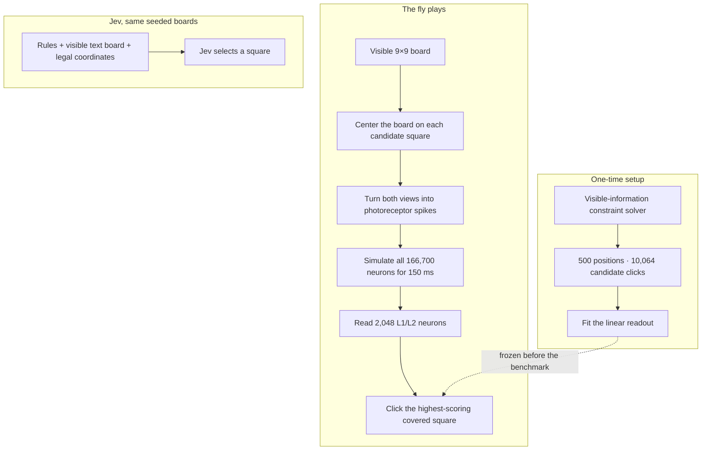
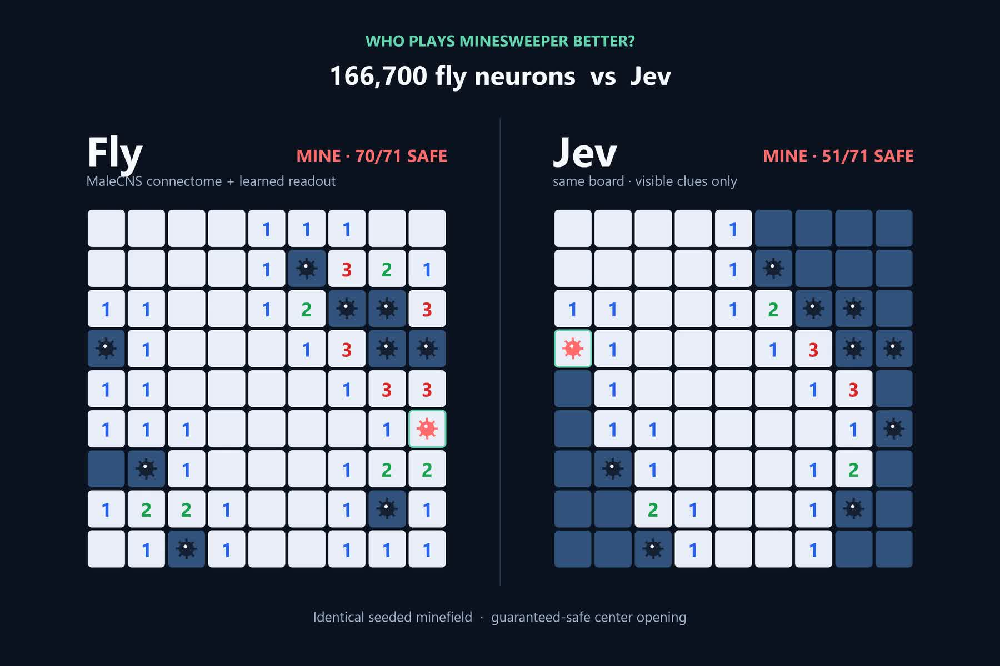

<h1 align="center">Fly vs Jev: Minesweeper</h1>

<p align="center"><b>A simulated fruit-fly brain against an AI model, on the same Minesweeper boards.</b><br>
The full wiring of an adult fly—all 166,700 neurons—sees only the revealed clues and picks every square. TypeSafe AI's Jev gets the same view.</p>

<p align="center">
  
</p>

## How it works

1. **Board.** Each game is beginner Minesweeper: 9×9, 10 mines, and a guaranteed-safe center opening. A seed fixes the minefield before either player moves.
2. **Eyes.** The left eye sees all 81 visible cells. The right eye sees the same board centered on one proposed click. Covered squares, revealed clues, board edges, and the candidate marker become photoreceptor spike rates; hidden mines never enter the input.
3. **Brain.** Each candidate runs through the MaleCNS connectome as a deterministic spiking network for 150 ms. The wiring of its 166,700 neurons and 6.2 million connections is never trained or changed.
4. **Move.** A linear readout over 2,048 L1/L2 neurons scores the candidates. It learned once from a visible-information constraint solver, then played these games without the solver.
5. **Jev.** Jev receives the rules, a coordinate-labelled text board, and every currently covered coordinate, then selects one through the Vercel AI Gateway.



## Results

Sixteen held-out boards, seeds 6000–6015. The score is the number of safe squares visible when the player clears the board or hits a mine; 71 is a perfect clear.

| Player | Boards | Clears | Mean safe squares | Median |
|---|---:|---:|---:|---:|
| **Fly (connectome + readout)** | **16** | **0** | **59.8 / 71** | **62** |
| Jev | 16 | 0 | 49.0 / 71 | 49 |
| Random clicks | 16 | 0 | 52.6 / 71 | 52 |
| Visible-information constraint solver | 16 | 16 | 71.0 / 71 | 71 |

The fly revealed more safe squares than Jev on 14 boards; Jev led on one and one tied (two-sided sign test, p = 0.00098). Neither learned player fully cleared a board, so this is evidence that the fly survived longer—not that it solved Minesweeper.

### Held-out gate

The readout chose an optimal or score-tied click on **53.5%** of held-out teacher positions, compared with **5.3%** for chance. A linear readout attached directly to the 162 eye channels, bypassing the brain, reached 48.5%.

### Pathway controls

| Control | Mean safe squares |
|---|---:|
| Intact fly | **59.8 / 71** |
| Readout silenced | 54.0 / 71 |
| Eye wiring shuffled | 51.1 / 71 |
| Readout weights shuffled | 50.4 / 71 |

Breaking the learned pathway removes the intact fly's edge. Every saved result, including every click, is in [`results/games`](results/games); the frozen weights and held-out report are in [`results/readout.npz`](results/readout.npz) and [`results/gate.json`](results/gate.json).

## The video

The GIF above and the full MP4 replay seed 6012. Jev hits a mine after revealing 51 safe squares. The fly reaches 70 of 71—one safe square short—before its final click is also a mine.

**[Watch/download the 1080p comparison with sound](media/fly-vs-jev.mp4)**

Every reveal is regenerated from the seed and saved moves, and the replay must reach the recorded terminal state. The renderer starts on a useful first frame, animates each click and flood reveal, exposes the minefield at game over, and synthesizes stereo clicks, reveal chimes, and mine thumps with the fly panned left and Jev right.

<p align="center"></p>

## Run it

```bash
pip install numpy pandas pyarrow torch pillow modal
python tests/test_game.py

# Train and play the fly on a Modal L4, using the Flytris connectome volume.
modal run scripts/modal_minesweeper.py::build_readout --positions 500 --keep 2048
modal run scripts/modal_minesweeper.py::fly_games --first 6000 --last 6016 --control none

# Run Jev and the CPU baselines.
AI_GATEWAY_API_KEY=... python scripts/jev_games.py 6000 6016 4
python scripts/baselines.py 6000 6016
python scripts/scoreboard.py 6000 6016

# Render the selected comparison; ffmpeg is required.
python video/render.py 6012
```

| Folder | What's in it |
|---|---|
| [`minesweeper/`](minesweeper/) | deterministic game, constraint teacher, eye encoding, connectome simulation, fly player, and Jev adapter |
| [`scripts/`](scripts/) | readout training, Modal jobs, games, controls, baselines, export, and scoreboard |
| [`video/`](video/) | verified replay renderer and synthesized sound |
| [`results/`](results/) | every benchmark game, frozen readout, and held-out gate |
| [`tests/`](tests/) | deterministic boards, flood reveals, solver soundness, and exact replay checks |

## Credits

MaleCNS v1.0 connectome by FlyEM (HHMI Janelia), Cambridge, MRC LMB, and Google Research, CC BY 4.0 ([Berg et al. 2026](https://doi.org/10.1016/j.cell.2026.08.015)). Neuron-model constants adapted from [Shiu et al. 2024](https://github.com/philshiu/Drosophila_brain_model). Jev by [TypeSafe AI](https://www.typesafe.ai) through the [Vercel AI Gateway](https://vercel.com/ai-gateway/models/jev). Compute by [Modal](https://modal.com).
