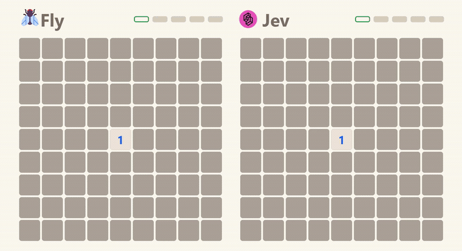
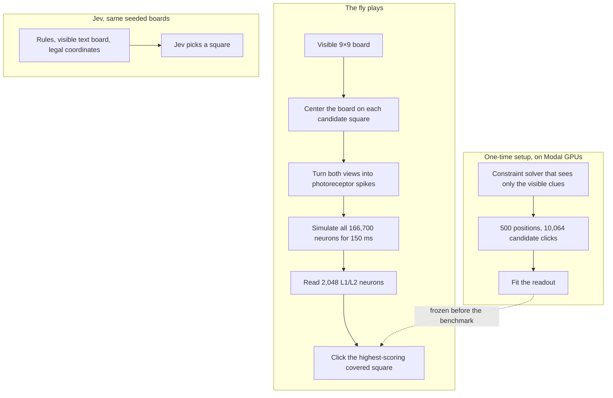

<h1 align="center">Fly vs Jev: Minesweeper</h1>

<p align="center"><b>A simulated fruit fly brain against an AI model, at Minesweeper.</b><br>
The full wiring of an adult fly, all 166,700 neurons, sees only the revealed clues and picks every square. TypeSafe AI's Jev gets the same view.</p>

<p align="center">
  
</p>

## How it works

1. **Board.** Each game is beginner Minesweeper: 9×9, 10 mines, and a guaranteed-safe center opening. A seed fixes the minefield before either player moves.
2. **Eyes.** The left eye sees all 81 visible cells. The right eye sees the same board centered on one proposed click. Covered squares, revealed clues, board edges and the candidate marker become photoreceptor spike rates. Hidden mines never enter the input.
3. **Brain.** Each candidate runs through the MaleCNS connectome as a deterministic spiking network for 150 ms. The wiring of its 166,700 neurons and 6.2 million connections is never trained or changed. This is the same simulator as [Flytris](https://github.com/EnesYilmazcode/Flytris).
4. **Move.** A readout over 2,048 L1/L2 neurons scores the candidates and the fly clicks the best one. The readout is the only part that learned: it learned once from a constraint solver that sees only what the player sees, then played these games without it.
5. **Jev.** Jev gets the rules and a coordinate-labelled text board. It judges every covered square as safe or mined, clicks its safest one, and flags as many lowest-safety squares as the board has mines.

Both players get the same seeded boards, and neither is ever shown a hidden mine.

## System design

During a game the solver is never consulted: every fly click comes from simulated neurons and the readout on top. The solver only supplied examples once, during setup.



## Results

Sixteen held-out boards, seeds 6000 to 6015. The score is the number of safe squares visible when the player clears the board or hits a mine. 71 is a perfect clear.

| Player | Boards | Clears | Avg safe squares | Median |
|---|---:|---:|---:|---:|
| **The fly** | **16** | **0** | **59.8 / 71** | **62** |
| Jev | 16 | 0 | 59.1 / 71 | 60 |
| Random clicks | 16 | 0 | 52.6 / 71 | 52 |
| The constraint solver | 16 | 16 | 71.0 / 71 | 71 |

The fly revealed more safe squares than Jev on nine boards, Jev led on six, one tied. That difference is not statistically clear (sign test p = 0.61). Both learned players substantially outlast random clicking, but neither cleared any of the sixteen. Ten mines is near the edge of what either can finish: over the larger pools behind the video, the fly cleared 2 of 510 ten-mine boards and Jev 2 of 500.

The readout picked an optimal or score-tied click on **53.5%** of held-out solver positions, against **5.3%** for chance. The same readout wired straight to the 162 eye channels, with no brain in between, reached 48.5%. So the skill comes from the trained readout, not from the brain being clever on its own. What the brain is required for, the controls show.

| Control, 16 games | Avg safe squares |
|---|---:|
| Intact fly | **59.8 / 71** |
| Readout silenced | 54.0 / 71 |
| Eye wiring shuffled | 51.1 / 71 |
| Readout weights shuffled | 50.4 / 71 |

Break one part of the pathway and the fly's edge disappears. Every saved result, including every click, is in [`results/games`](results/games). The frozen weights and the held-out report are in [`results/readout.npz`](results/readout.npz) and [`results/gate.json`](results/gate.json).

## The video

Five stages up a mine ladder. Stage one is a six-mine board, stage five is a ten-mine one, and every board begins with exactly one center clue showing. Each lane advances the moment it clears, so neither player waits for the other.

| Stage | Mines | The fly | Jev |
|---|---:|---|---|
| 1 | 6 | cleared in 9 clicks | cleared in 8 clicks |
| 2 | 7 | cleared in 15 clicks | cleared in 8 clicks |
| 3 | 8 | cleared in 9 clicks | cleared in 10 clicks |
| 4 | 9 | cleared in 11 clicks | cleared in 7 clicks |
| 5 | 10 | **cleared in 12 clicks** | **mine on click 7, with 68 of 71 safe squares open** |

Jev's race ends at 14.2 seconds, three squares short of the top of the ladder, and the fly plays on alone until 18.0.

The ladder is there because of the cascade. On a 9×9 board with five mines the widest single click in a game opens 88% of the grid, and on 99% of boards some click opens more than half of it, so a whole game is over in six clicks. At ten mines the widest click opens 56% and a game takes nineteen. Mine count, not board size, is the knob: a 10×10 board with ten mines cascades exactly as hard as a 9×9 with eight, 66% either way, because what matters is the density. Measured over 250 boards per setting under perfect play.

The boards are chosen, so the pools they were chosen from are on the record. Each stage is drawn from an independently seeded pool at that mine count, keeping only boards whose opening click shows a single clue.

| Mines | Fly clears | Jev clears |
|---|---:|---:|
| 6 | 49 / 300 | 19 / 300 |
| 7 | 17 / 300 | 9 / 300 |
| 8 | 8 / 300 | 5 / 300 |
| 9 | 4 / 400 | 2 / 400 |
| 10 | 2 / 510 | 2 / 500 |

At ten mines a loss is the ordinary result for both players, so Jev's final board is one of the 498 losses in its pool, picked to end while the fly is still playing.

Each player has a pointer, blue for the fly and TypeSafe pink for Jev. It rests on the square it just opened while that reveal plays, then glides to its next choice and arrives as the click lands. The header boxes fill green as stages are passed and turn red on a stage a player loses. After play begins, each player flags as many squares as the board has mines, the ones it currently rates most dangerous, straight from its recorded scores. Every reveal, flag and pointer move is regenerated from the saved record in [`results/showcase/race.json`](results/showcase/race.json), and every replay must reach its recorded terminal state. The sound is synthesized: a tick per click, a sparkle that rises with the size of a flood reveal, a chord on a clear, a thump on a mine, with the fly panned left and Jev right.

**[Watch/download the full comparison with sound](media/fly-vs-jev.mp4)**

<p align="center"></p>

## Run it

```bash
pip install numpy pandas pyarrow torch pillow modal
python tests/test_game.py                       # engine, solver and replay checks
python tests/test_render.py                     # pointer timing and pacing
modal run scripts/modal_minesweeper.py::build_readout --positions 500 --keep 2048
modal run scripts/modal_minesweeper.py::fly_games --first 6000 --last 6016
AI_GATEWAY_API_KEY=... python scripts/jev_games.py 6000 6016 4
python scripts/baselines.py 6000 6016
python scripts/scoreboard.py 6000 6016

# The race: one pool per rung of the ladder, then the stages and the media.
modal run scripts/modal_minesweeper.py::fly_games --first 86000 --last 86300 --mines 6 --opening-radius 0
AI_GATEWAY_API_KEY=... python scripts/jev_pools.py 6,7,8,9,10
python scripts/build_race.py 6,7,8,9,10
python video/publish.py                         # needs ffmpeg
```

The connectome comes from the Flytris repo's `data/malecns`, and the Modal jobs mount the same data as a volume. The benchmark, the controls and the five race pools come to 1,976 fly games on Modal L4s, one job per rung; the six-mine pool of 300 games took 11 minutes. Jev played 2,066 games for 47.1 million input tokens.

| Folder | What's in it |
|---|---|
| [`minesweeper/`](minesweeper/) | the game, the constraint solver, the eyes, the connectome simulator, the fly player, the Jev player |
| [`scripts/`](scripts/) | building the readout, Modal jobs, games, controls, baselines, race pools, picking the stages, the scoreboard |
| [`video/`](video/) | the verified replay renderer, the sound, the media publish step |
| [`results/`](results/) | every game from every player, the frozen readout, its gate report, the race record |
| [`tests/`](tests/) | boards, flood reveals, solver soundness, exact replays, pointer timing |

## Credits

MaleCNS v1.0 connectome by FlyEM (HHMI Janelia), Cambridge, MRC LMB and Google Research, CC BY 4.0 ([Berg et al. 2026](https://doi.org/10.1016/j.cell.2026.08.015)). Neuron model constants from [Shiu et al. 2024](https://github.com/philshiu/Drosophila_brain_model). Jev by [TypeSafe AI](https://www.typesafe.ai) through the [Vercel AI Gateway](https://vercel.com/ai-gateway/models/jev). Compute by [Modal](https://modal.com).
